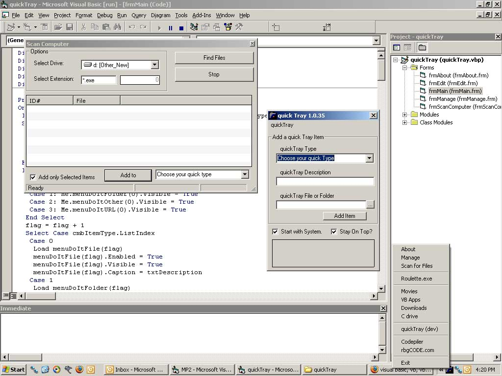



## A new Update,  \( quick tray\) quickTray 1\.0\.34

### Description

thisis an update to my last project, I have added drag and drop like someone asked, I also added a hard drive scanner to find certain types of folder, and a small beta screen to deleted and modify your current favorites. I am going to work on the GUI now, but please post any suggestions and I will build them in asap!!
 
### More Info
 
Like I said before, this application has been known to cause slight cases of efficiency!

             |
---                |---
**Submitted On**   |2004-08-11 20:11:32
**By**             |[rBg](https://github.com/Planet-Source-Code/PSCIndex/blob/master/ByAuthor/rbg.md)
**Level**          |Intermediate
**User Rating**    |5.0 (10 globes from 2 users)
**Compatibility**  |VB 4\.0 \(32\-bit\), VB 5\.0
**Category**       |[Files/ File Controls/ Input/ Output](https://github.com/Planet-Source-Code/PSCIndex/blob/master/ByCategory/files-file-controls-input-output__1-3.md)
**World**          |[Visual Basic](https://github.com/Planet-Source-Code/PSCIndex/blob/master/ByWorld/visual-basic.md)
**Archive File**   |[A\_new\_Upda1780778112004\.zip](https://github.com/Planet-Source-Code/rbg-a-new-update-quick-tray-quicktray-1-0-34__1-55510/archive/master.zip)

### API Declarations

Like I said before, this application has been known to cause slight cases of efficiency!

